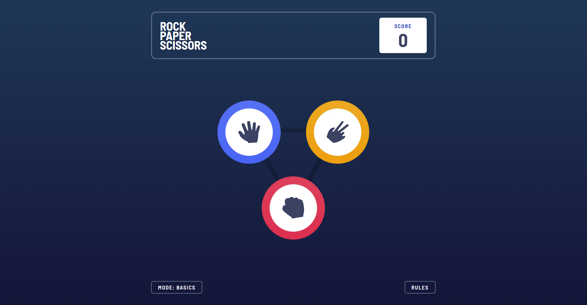

# Frontend Mentor - Rock, Paper, Scissors solution

This is a solution to the [Rock, Paper, Scissors challenge on Frontend Mentor](https://www.frontendmentor.io/challenges/rock-paper-scissors-game-pTgwgvgH). Frontend Mentor challenges help you improve your coding skills by building realistic projects.

## Table of contents

- [Overview](#overview)
  - [The challenge](#the-challenge)
  - [Screenshot](#screenshot)
  - [Links](#links)
- [My process](#my-process)
  - [Built with](#built-with)
  - [What I learned](#what-i-learned)
  - [Continued development](#continued-development)
  - [Useful resources](#useful-resources)
- [Author](#author)
- [Acknowledgments](#acknowledgments)

## Overview

### The challenge

Users should be able to:

- View the optimal layout for the game depending on their device's screen size
- Play Rock, Paper, Scissors against the computer
- Maintain the state of the score after refreshing the browser
- **Advanced**: Play Rock, Paper, Scissors, Lizard, Spock against the computer

### Screenshot

### Links

- Solution URL: [Github](https://github.com/mqdo/rock-paper-scissors)
- Live Site URL: [Netlify](https://mqdo-rock-paper-scissors.netlify.app/)

## My process

### Built with

- [React](https://reactjs.org/) - JS library
- [Tailwind CSS](https://tailwindcss.com/) - For styles

### What I learned

In this challenge, I learned to make gradient background and custom animation with Tailwind CSS. I also had to put sections into shapes like triangles or pentagon which is pretty fun! Besides that I also practiced with useLocalStorage and popup sections again.

### Continued development

Even though I completed the challenge, I still want to improve it more, such as making sound plays when each game completed.

### Useful resources

- [Codepen](https://codepen.io/ofthedead/pen/rVLgNy) - This helped me for making the waves animation. The source code was just wow, I copied the keyframes and animations but still far away from the original!

## Author

- Website - [mqdo](https://github.com/mqdo/)
- Frontend Mentor - [@mqdo](https://www.frontendmentor.io/profile/mqdo)
- Twitter - [@mqdo_dev](https://www.twitter.com/mqdo_dev)

## Acknowledgments

This is where you can give a hat tip to anyone who helped you out on this project. Perhaps you worked in a team or got some inspiration from someone else's solution. This is the perfect place to give them some credit.
